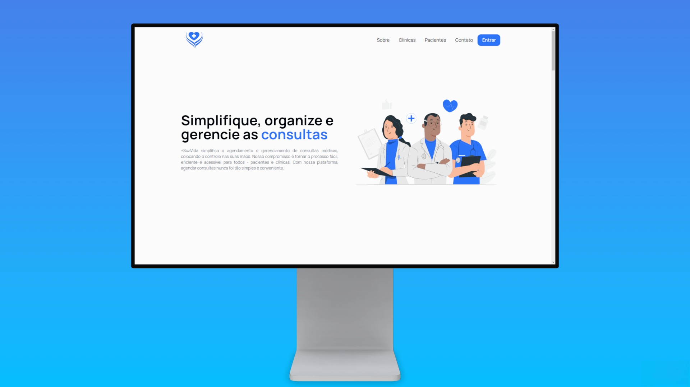

# Frontend Web
Este é o frontend web do projeto, uma plataforma dedicada a facilitar a gestão de clínicas e médicos.



## Tecnologias Utilizadas

- [Next.js](https://nextjs.org/)
- [Next-auth](https://next-auth.js.org/)
- [React](https://react.dev/)
- [Tailwind CSS](https://tailwindcss.com/)
- [Axios](https://axios-http.com/ptbr/docs/intro)
- [Zod](https://zod.dev/)
- [React Hook Form](https://react-hook-form.com/)

## Demonstração

### Para clínicas
https://github.com/Matheussandi/mais-sua-vida/assets/29473781/76764cbc-bfde-42a4-8cb5-74d1c2832e33

### Para médicos
https://github.com/Matheussandi/mais-sua-vida/assets/29473781/7b079c6b-7731-4d58-b8e3-e6082c9e91f9

## Iniciando o Projeto

Para começar a usar o projeto, siga os passos abaixo:

### 1. Instalando as dependências

Antes de tudo, é necessário instalar as dependências do projeto. Certifique-se de que você possui o Node.js e o npm (Node Package Manager) instalados em seu sistema.

No terminal, navegue até a pasta raiz do projeto e execute o seguinte comando:

```bash
npm install
```
Esse comando irá baixar e instalar todas as dependências necessárias para o projeto.

### 2. Env

Crie um arquivo .env e adione a url da api da imagem.

```ts
// Exemplo
NEXT_PUBLIC_API_IMAGE=http://localhost:(porta)/uploads
```

### 3. Executando o Projeto

```bash
npm run dev
```

Este comando irá iniciar o servidor de desenvolvimento. Por padrão, o projeto estará disponível na porta 3000. Para visualizá-lo, basta abrir seu navegador e acessar o seguinte endereço: [http://localhost:3000](http://localhost:3000).

### 4. Chamada à API
A chamada à API está no arquivo `api.ts` da pasta `lib`, onde são feitas as requisições e interações com o servidor.

## Imagens 
Imagens utilizadas através dos sites:
- [Unsplash](https://unsplash.com/)
- [Freepik](https://www.freepik.com/)